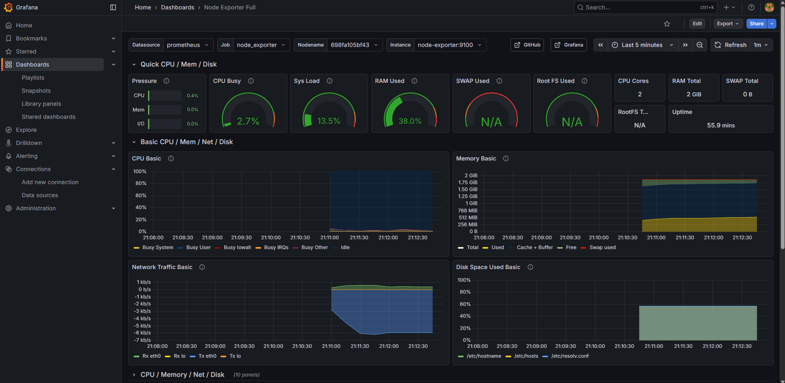

# Monitor-the-Docker-Container-using-grafana-prometheus
    

## Services Included
- Prometheus
- Grafana
- Alertmanager
- Node Exporter
- cAdvisor

## Ports
- Grafana: 3000
- Prometheus: 9090
- Alertmanager: 9093
- Node Exporter: 9100
- cAdvisor: 8080

## Install Docker to EC2 Instance
```bash

docker-compose up -d

Access URLs

Grafana: http://EC2_PUBLIC_IP:3000

Prometheus: http://EC2_PUBLIC_IP:9090

Alertmanager: http://EC2_PUBLIC_IP:9093

Grafana Login

Username: admin

Password: admin

Recommended Dashboards

Node Exporter: 1860

Docker Containers: 14282


Step 10: Configure Grafana
Add Prometheus Data Source

Settings → Data Sources → Add

Type: Prometheus

URL: http://prometheus:9090

Save

Import Dashboards

Recommended dashboard IDs:

Node Exporter → 1860

Docker / cAdvisor → 14282


### Screenshots



